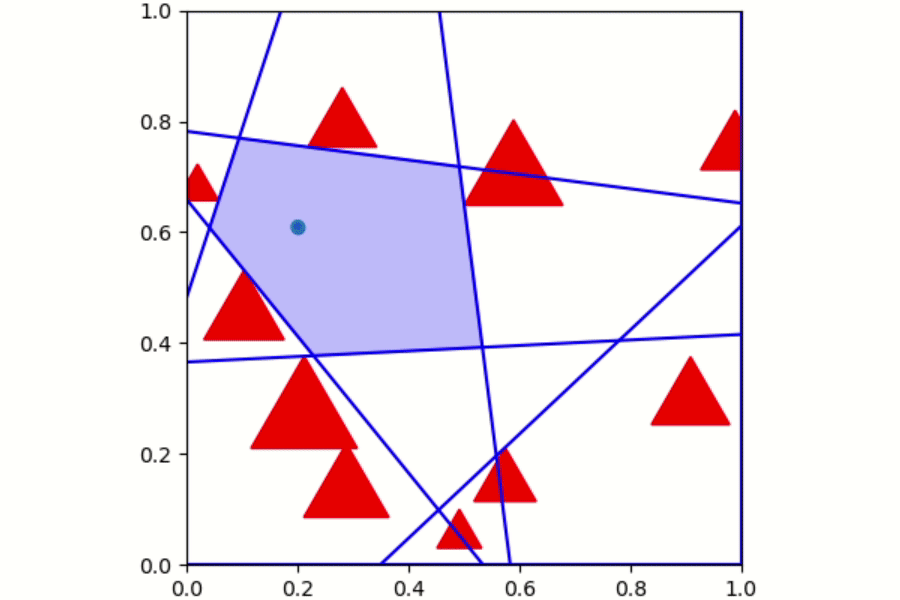
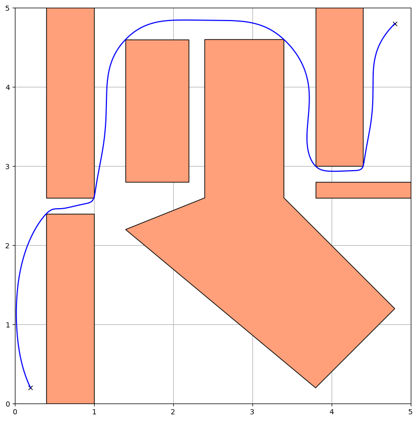
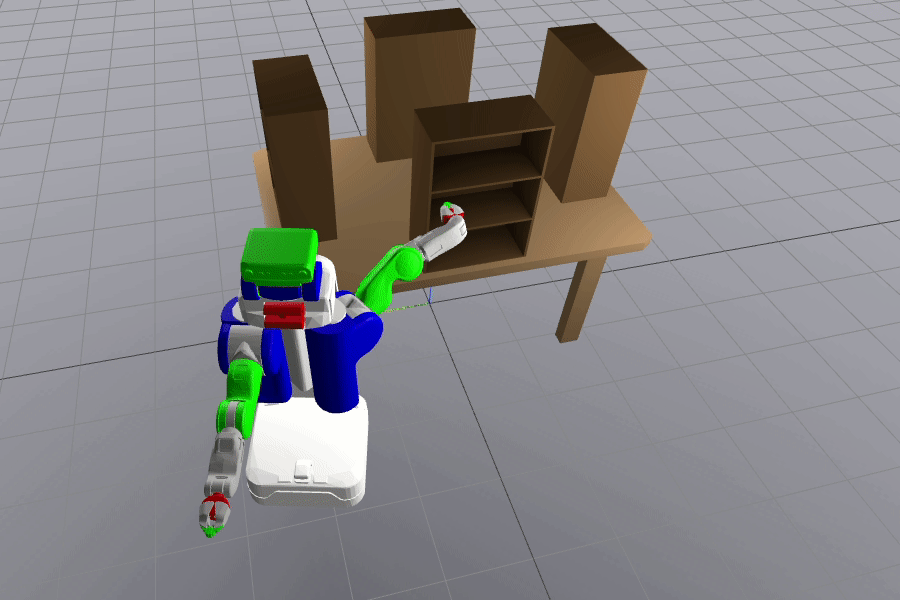
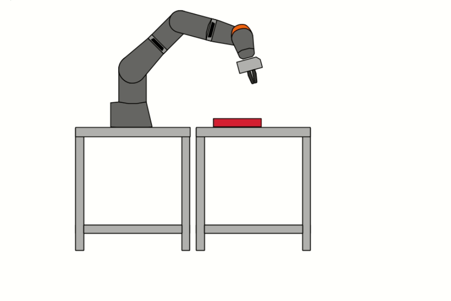
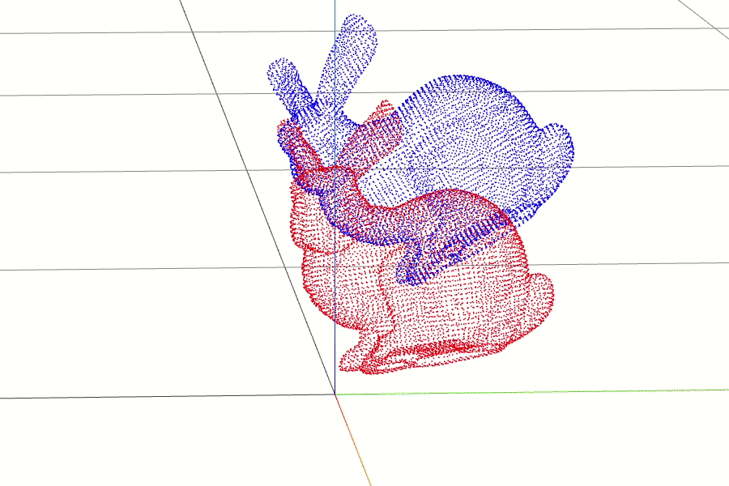

# manipulation

My study corner for MIT 6.4212 - Robotic Manipulation by Prof. Russ Tedrake. I've learned a lot from this wonderful robotics course.

## Course Description

> Introduces the fundamental algorithmic approaches for creating robot systems that can autonomously manipulate physical objects in unstructured environments such as homes and restaurants. Topics include perception (including approaches based on deep learning and approaches based on 3D geometry), planning (robot kinematics and trajectory generation, collision-free motion planning, task-and-motion planning, and planning under uncertainty), as well as dynamics and control (both model-based and learning-based).

## My Words

This repository only presents my personal work within the course. I would be very happy if it helps you to gain more knowledge and I could get constructive feedback from you. Let's learn together.

If GitHub cannot render .ipynb files, check [this](https://github.com/community/community/discussions/41020), or open with `github.dev`, or just download the files.

Please star ⭐ if you find it useful.

## Some Results

Perception-based pick and place

Iterative Regional Inflation by Semidefinite programming (IRIS)

Graph of Convex Sets (GCS) with Bezier order = 6 and continuity order = 2

Kinematic trajectory optimization

Door openning kinematic trajectory optimization

Mobile manipulation inverse kinematic optimization

Hybrid motion/force control for dragging

Stanford bunny ICP

Grasp planning with point clouds